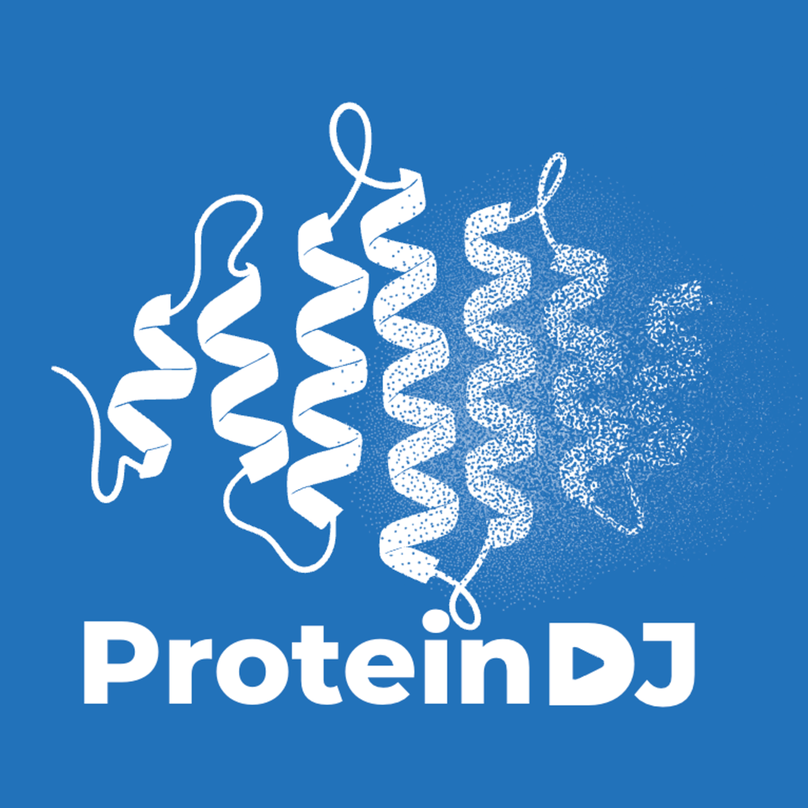
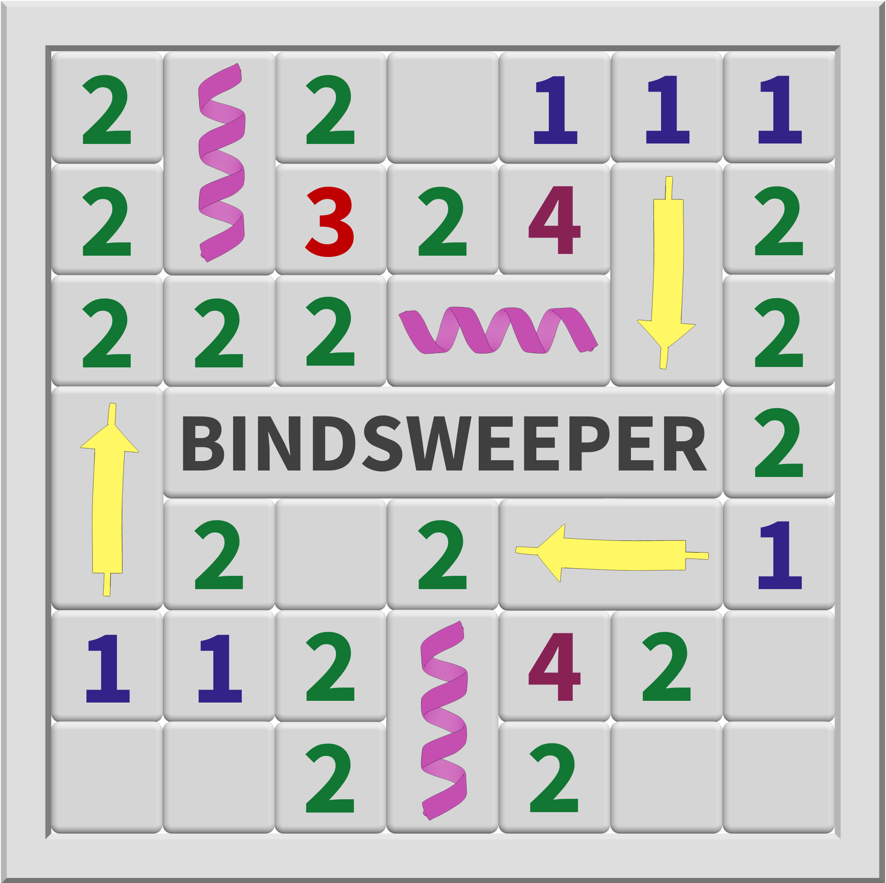
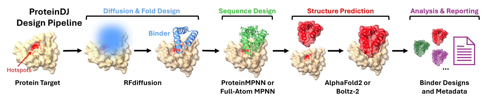
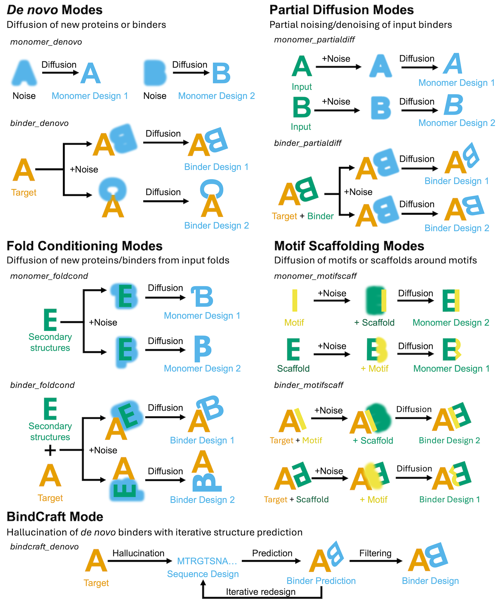
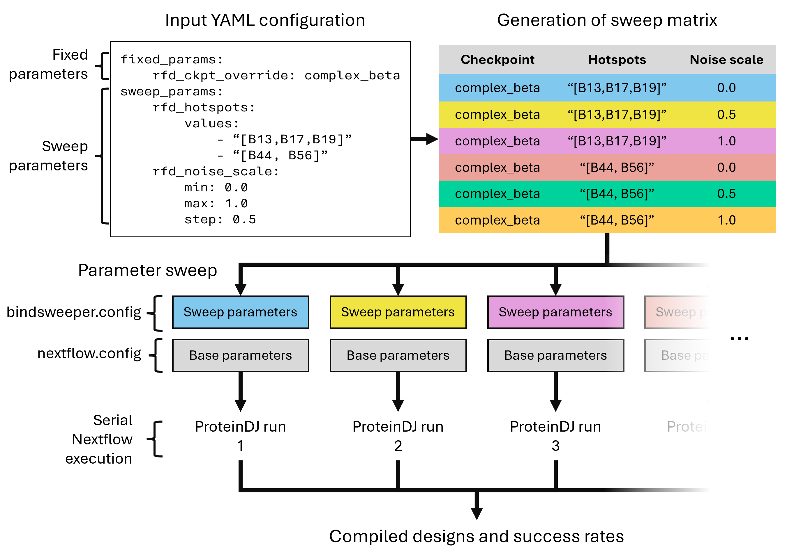

# ProteinDJ & BindSweeper



[bioRxiv Preprint](https://www.biorxiv.org/cgi/content/short/2025.09.24.678028v1)

ProteinDJ is a Nextflow pipeline for protein design that installs and utilises multiple external software packages, including:

- AlphaFold2 Initial Guess (from https://github.com/nrbennet/dl_binder_design)
- BindCraft (from https://github.com/martinpacesa/BindCraft)
- BioPython (from https://biopython.org/)
- Boltz-2 (from https://github.com/jwohlwend/boltz)
- Full-Atom MPNN (from https://github.com/richardshuai/fampnn)
- HyperMPNN (from https://github.com/meilerlab/HyperMPNN)
- ProteinMPNN-FastRelax (from https://github.com/nrbennet/dl_binder_design)
- RFdiffusion (from https://github.com/RosettaCommons/RFdiffusion)
- PyRosetta (from https://www.pyrosetta.org/)

BindSweeper provides a convenient wrapper for ProteinDJ, enabling sweeping of different parameters for binder design.

If you find ProteinDJ or BindSweeper useful in your research, please [cite us](https://www.biorxiv.org/cgi/content/short/2025.09.24.678028v1) and the developers of the software listed above that make protein design pipelines like this possible. We have provided a list of citations [here](#citations).

> Please note: PyRosetta requires a license for commercial projects and is used extensively within ProteinDJ, AlphaFold2 Initial Guess, and ProteinMPNN-FastRelax.

<sup>_Logo image credit: Lyn Deng, Joshua Hardy_</sup>

## Table of Contents

- [Installation](#install)
- [Using ProteinDJ](#execution)
- [Advanced Parameters](#params)
- [Filtering Designs](#params-filter)
- [Metrics and Metadata](#metrics)
- [BindSweeper](#bindsweeper)
- [Appendices](#append)
  - [Known limitations and planned improvements](#limitations)
  - [Seqera Support](#seqera)
  - [Troubleshooting and common errors](#errors)
  - [Data used for benchmarking](#append-bench)
  - [Citations for software packages used in ProteinDJ](#append-citations)

## Installation <a name="install"></a>

ProteinDJ requires that [Apptainer](https://apptainer.org/docs/admin/main/installation.html) and [Nextflow](https://www.nextflow.io/docs/latest/install.html) (≥ v24.04) are installed and accessible to the path. 

First, clone the repo for ProteinDJ:

```
git clone https://github.com/PapenfussLab/proteindj
cd proteindj
```

Next, download the models for AF2, Boltz, and RFdiffusion (~11 GB) using the download script . This may take a while depending on your internet connection. Note that this only needs to be done once on a cluster as long as the files and containers are in a location that can be accessed by all users (see [Installation Guide](docs/installation.md) for more details):

```
bash scripts/download_models.sh
```

Apptainer will automatically fetch containers as needed during the Nextflow run and cache them locally to the location specified by the environment variable `NXF_APPTAINER_CACHEDIR`. If you would like to build containers locally, you can follow our [Installation Guide](docs/installation.md).

## Using ProteinDJ <a name="execution"></a>

The ProteinDJ consists of four stages:

1. Fold Design - Using RFdiffusion or BindCraft
2. Sequence Design - Using ProteinMPNN or Full-Atom MPNN
3. Structure Prediction - Using AlphaFold2 Initial Guess or Boltz-2
4. Analysis and Reporting - Using PyRosetta and BioPython



Due to the creative nature of protein design and the complexity of RFdiffusion there are many ways you can use ProteinDJ. To help with delineating this, we have created design modes for ProteinDJ. Each mode is described in detail in our [Guide to Design Modes](docs/modes.md), but for now, here's a quick summary of each one with a simple illustration of each mode in action:

- **monomer_denovo** – diffusion of new monomers from noise
- **monomer_foldcond** – diffusion of new monomers with fold-conditioning on scaffolds/templates
- **monomer_motifscaff** – inpainting/extension of input monomers
- **monomer_partialdiff** – partial diffusion of input monomers
- **binder_denovo** – diffusion of new binders from noise
- **binder_foldcond** – diffusion of new binders with fold-conditioning on scaffolds/templates
- **binder_motifscaff** – diffusion of binding motifs in input scaffolds
- **binder_partialdiff** – partial diffusion of a binder from an input PDB
- **bindcraft_denovo** - hallucination of new binders using BindCraft



All the settings and parameters for ProteinDJ can be found in the `nextflow.config` file. It contains a lot of optional parameters, but there are 4 essential parameters to pay attention to: the protein design mode (`design_mode`), the number of designs (`num_designs`) and sequences you want to generate (`seqs_per_design`), and the output directory path (`out_dir`).

| Parameter         | Example Value      | Description                                                                                                                                                                                     |
| ----------------- | ------------------ | ----------------------------------------------------------------------------------------------------------------------------------------------------------------------------------------------- |
| `design_mode`        | `'monomer_denovo'` | Pipeline mode. Choose from 'monomer_denovo', 'monomer_foldcond', 'monomer_motifscaff', 'monomer_partialdiff', 'binder_denovo', 'binder_foldcond', 'binder_motifscaff', 'binder_partialdiff', or 'bindcraft_denovo'. |
| `num_designs` | `8`                | Number of designs to generate using RFdiffusion or Bindcraft.                                                                                                                                                |
| `seqs_per_design` | `8`                | Number of sequences to generate per design.                                                                                                                                         |
| `out_dir`         | `'./pdj_results'`  | Output directory for results. Existing results in this directory will be overwritten.                                                                                                           |

The [RFdiffusion GitHub](https://github.com/RosettaCommons/RFdiffusion/) has a comprehensive explanation of the different parameters available for RFdiffusion with examples. Note that we have externalised many RFdiffusion parameters to Nextflow and added the prefix 'rfd' e.g. `num_designs`, `input_pdb` etc. You can find a detailed description of all ProteinDJ parameters [here](docs/parameters.md).

To launch a design campaign, simply run this command from the root of the `proteindj` repository:

`nextflow run main.nf`

This will launch the nextflow pipeline and show you progress in your terminal window. If you are running this over an ssh connection, you might want to use screen or tmux to avoid cancelling the process upon disconnect.

Note that by default, this will use the parameters in `nextflow.config` file in the installation folder, but you can specify a different config file. This can be useful if you want to queue different design campaigns with alternative parameters (just be sure to specify unique output directories for each):

`nextflow run main.nf -c CONFIGFILE`

A helpful feature of the nextflow.config file is profiles. Profiles can be used to override parameters but are easier to edit. e.g. the
profile for the monomer_denovo mode looks like this. We recommend using the existing profiles as a reference for each mode.

```
monomer_denovo {
    params {
        design_mode = 'monomer_denovo'
        design_length = "60-80"
        seq_method = 'fampnn'
        pred_method = 'boltz'
    }
}
```

In this example, Nextflow will use all of the default parameter values from the params section except for `design_mode`, `design_length`, `seq_method` and `pred_method` (in this case to generate a de novo monomer 60-80 residues in length with RFdiffusion, Full-Atom MPNN and Boltz-2). You can use profiles by adding the `-profile` flag. e.g.

`nextflow run main.nf -profile monomer_denovo`

You can specify multiple profiles, for example, to combine a profile for your HPC environment (e.g. Milton at WEHI) with a design mode profile:

`nextflow run main.nf -profile milton,binder_denovo`

After running the pipeline, you can find all the results as well as intermediate files and logs in your specified `out_dir` organised as below:

```
out_dir/
├── configs/              # Config files used for run
├── inputs/               # Input files used in run e.g. PDB files for binder design
├── run/                  # Intermediate results and log files with subfolders for each process
├── results/              # Final results and metadata
    ├── best_designs/     # Directory containing PDB files of designs that passed all filters
    ├── all_designs.csv   # CSV file with metadata for all designs
    └── best_designs.csv  # CSV file with metadata for designs that passed all filters
└── nextflow.log          # Copy of Nextflow log from run
```

> Tip: If your run gets interrupted you can resume from the last completed step by using the -resume flag e.g. `nextflow run main.nf -profile monomer_denovo -resume`

## Advanced Parameters <a name="params"></a>

We have aimed to provide as much functionality as possible of the underlying software packages and there are many parameters you can adjust. Here is a [Parameter Guide](docs/parameters.md) to all of the parameters that are configurable within the `nextflow.config` file.

## Filtering Designs <a name="params-filter"></a>

Due to the inherently stochastic nature of protein design, often we see problematic results during the pipeline. It can save computation time to discard designs mid-pipeline that fail to meet success criteria. We have implemented three filtering stages that can be used to reject poor designs:

- Fold Filtering - Filters designs according to the number of secondary structure elements and radius of gyration.
- Sequence Filtering - Filters designs according to the score of the generated sequence
- AlphaFold2/Boltz-2 Filtering - Filters designs according to the quality of the structure prediction

The most powerful predictors of experimental success are structure prediction metrics, but some metrics are more effective than others. Here are some recommended filters for binder design from the literature and their corresponding parameters in ProteinDJ:

| Parameter                  | RFdiffusion paper<sup>1</sup> | AlphaProteo whitepaper<sup>2</sup> |
| -------------------------- | --------------------- | ---------------------- |
| af2_max_pae_interaction    | 10                    | 7                      |
| af2_min_plddt_overall      | 80                    | 90                     |
| af2_max_rmsd_binder_bndaln | 1                     | 1.5                    |

<sup> 1. Watson, J.L. et al. Nature 620, 1089–1100 (2023). https://doi.org/10.1038/s41586-023-06415-8; 2. Zambaldi, V. et al. arXiv (2024). https://doi.org/10.48550/arXiv.2409.08022
</sup>

We recommend disabling other filters for small-scale and pilot experiments, and using these results to decide on values to use for filtering large-scale runs. We have prepared a [Filtering Guide](docs/parameters.md/#filtering-parameters) on all the filters available in ProteinDJ with recommended values for each.

## Metrics and metadata <a name="metrics"></a>

ProteinDJ generates and captures metadata for all designs in a CSV file '`all_designs.csv`' and the best designs if filtering is applied to '`best_designs.csv`'. See our [Metrics and Metadata Guide](docs/metrics.md) for a description of each metric.

## BindSweeper <a name="bindsweeper"></a>

BindSweeper is a python-based tool that can launch multiple instances of ProteinDJ to 'sweep' different binder design parameters e.g. hotspots, timesteps. For detailed information about installing and using BindSweeper, see the [BindSweeper User Guide](docs/bindsweeper.md).



## Appendices <a name="append"></a>

### Known limitations and planned improvements <a name="limitations"></a>

- Boltz-2:
  - Currently concatenates target chain sequences, meaning predictions of targets with chain-breaks or multiple chains is problematic

### Seqera Support <a name="seqera"></a>

We have designed ProteinDJ to be compatible with the [Seqera platform](https://seqera.io/platform/), so that jobs can be executed in the cloud or deployed on HPC. If you have access to Seqera, you can use the schema files in `schemas/`. There is a schema file for each mode with relevant parameters, defaults and input validation.

### Troubleshooting and common errors <a name="errors"></a>

`AssertionError: ('B', 134) is not in pdb file!` - A mismatch between your contigs and the input PDB file. Likely due to a chain break or an incorrect chain ID.

`KeyError: 'P1L'` - A non-standard amino acid code (e.g. P1L) is present in your input PDB and included in contigs. RFdiffusion only takes natural amino acids (i.e. 'ALA','ARG','ASN','ASP','CYS','GLN','GLU','GLY','HIS','ILE','LEU','LYS','MET','PHE','PRO','SER','THR','TRP','TYR','VAL') and unknown or masked amino acids ('UNK','MAS').

`Unknown variable 'metadata_ch_fold'` - We are using topic channels for metadata, and this feature is only available in Nextflow v24.04 and above. This error occurs with earlier versions of Nextflow.

### Data used for benchmarking <a name="append-bench"></a>

We used five structures for testing and benchmarking our pipeline.

| Protein           | PDB ID | Filename       | Contigs                                                | Hotspots           |
| ----------------- | ------ | -------------- | ------------------------------------------------------ | ------------------ |
| Influenza A H1 HA | 5VLI   | 5vli_ha.pdb    | [A4-53/A79-83/A110-114/A261-325/0 B501-568/B580-670/0] | [B521, B545, B552] |
| IL-7Rα            | 3DI3   | 3di3_il7ra.pdb | [B17-209/0]                                            | [B58, B80, B139]   |
| InsR              | 4ZXB   | 4zxb_ir.pdb    | [E6-155/0]                                             | [E64, E88, E96]    |
| PD-L1             | 5O45   | 5o45_pd-l1.pdb | [A17-131/0]                                            | [A56, A115, A123]  |
| TrkA              | 1WWW   | 1www_trka.pdb  | [X282-382/0]                                           | [X294, X296, X333] |

### Citations for software packages used in ProteinDJ <a name="append-citations"></a>

ProteinDJ: a high-performance and modular protein design pipeline - Silke, D., Iskander, J., Pan, J., Thompson, A.P., Papenfuss, A.T., Lucet, I.S., Hardy, J.M. bioRxiv. https://doi.org/10.1101/2025.09.24.678028

AlphaFold2 Initial Guess and ProteinMPNN-FastRelax - Bennett, N.R., Coventry, B., Goreshnik, I. et al. Improving de novo protein binder design with deep learning. Nat Commun 14, 2625 (2023). https://doi.org/10.1038/s41467-023-38328-5

AlphaFold2 - Jumper, J., Evans, R., Pritzel, A. et al. Highly accurate protein structure prediction with AlphaFold. Nature 596, 583–589 (2021). https://doi.org/10.1038/s41586-021-03819-2

BindCraft - Pacesa, M., Nickel, L., Schellhaas, C. et al. One-shot design of functional protein binders with BindCraft. Nature 646, 483-492 (2025). https://doi.org/10.1038/s41586-025-09429-6

BioPython - Cock, P. J., Antao, T. et al. Biopython: freely available Python tools for computational molecular biology and bioinformatics. Bioinformatics 25, 1422-1423, (2009). https://doi.org/10.1093/bioinformatics/btp163

Boltz-2 - Wohlwend, J., et al. Boltz-2 Democratizing Biomolecular Interaction Modeling, bioRxiv 2024.11.19.624167 (2024). https://doi.org/10.1101/2024.11.19.624167

Full-Atom MPNN - Shuai, R.W., et al. Sidechain conditioning and modeling for full-atom protein sequence design with FAMPNN, bioRxiv 2025.02.13.637498 (2025). https://doi.org/10.1101/2025.02.13.637498

HyperMPNN - Ertelt, M., Schlegel, P., Beining, M. et al. HyperMPNN-A general strategy to design thermostable proteins learned from hyperthermophiles. bioRxiv (2024) https://doi.org/10.1101/2024.11.26.625397

RFdiffusion - Watson, J.L., Juergens, D., Bennett, N.R. et al. De novo design of protein structure and function with RFdiffusion. Nature 620, 1089–1100 (2023). https://doi.org/10.1038/s41586-023-06415-8

ProteinMPNN - Dauparas, J., et al. Robust deep learning–based protein sequence design using ProteinMPNN. Science 378, 49-56 (2022). https://doi.org/10.1126/science.add2187

PyRosetta - S. Chaudhury, S. Lyskov & J. J. Gray, "PyRosetta: a script-based interface for implementing molecular modeling algorithms using Rosetta," Bioinformatics, 26(5), 689-691 (2010)
