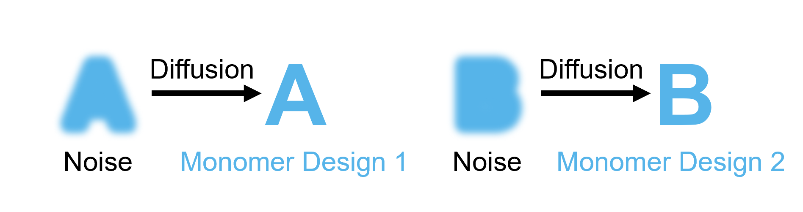
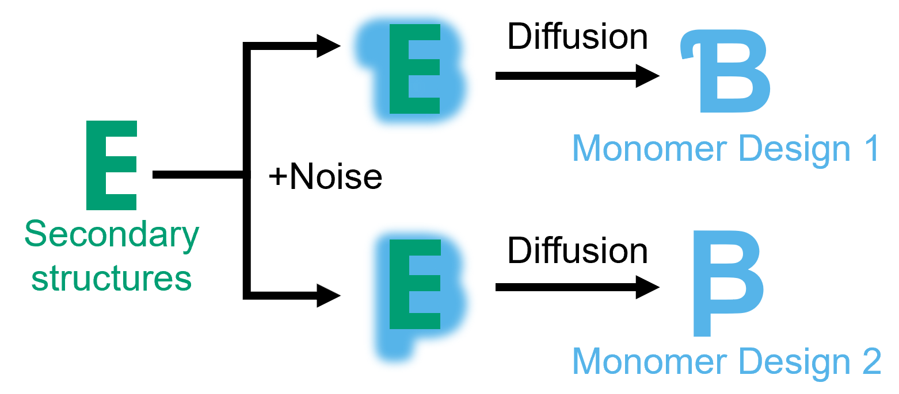
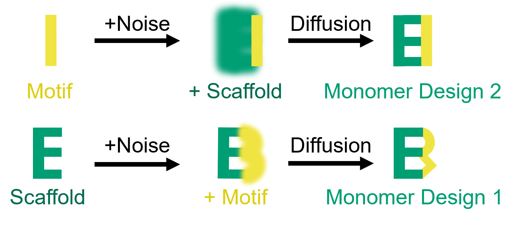
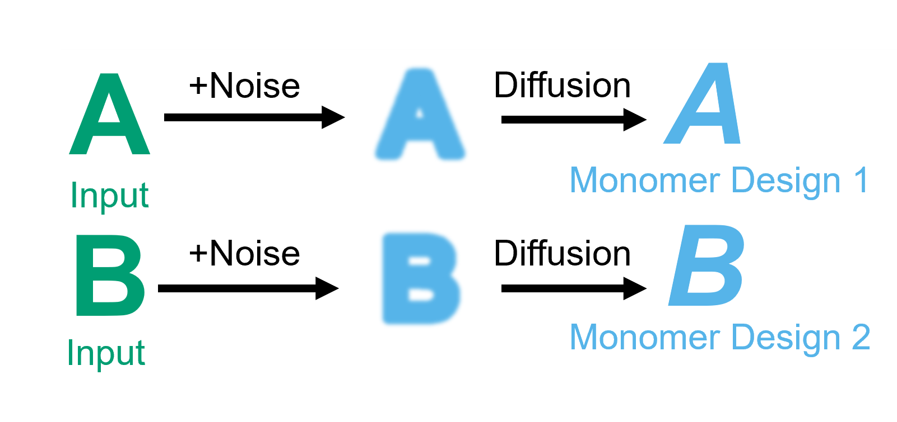
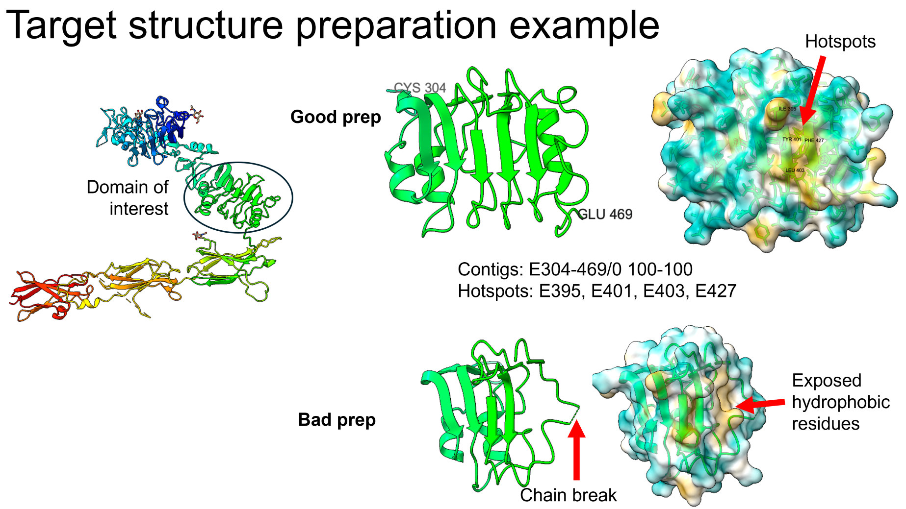
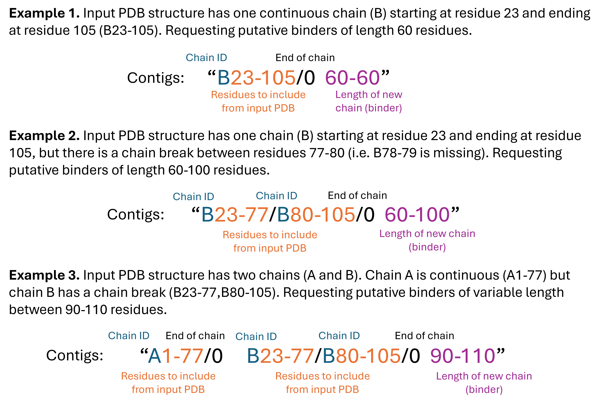
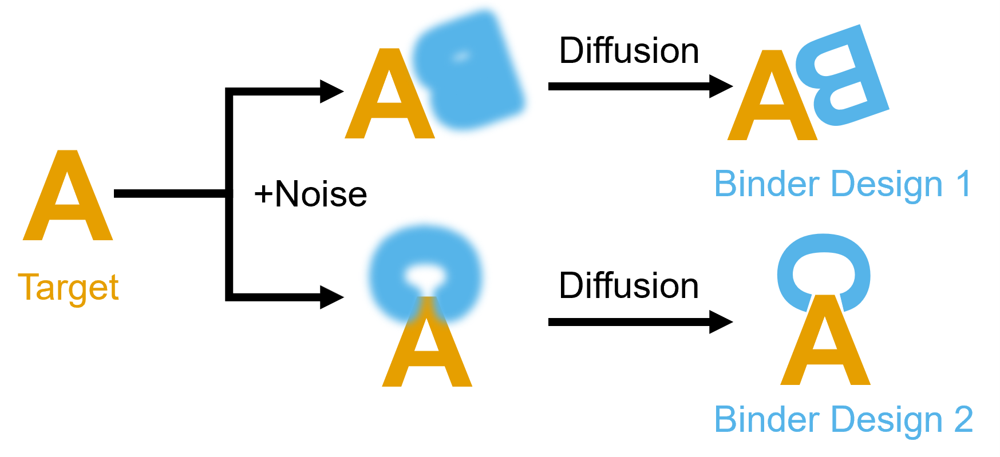
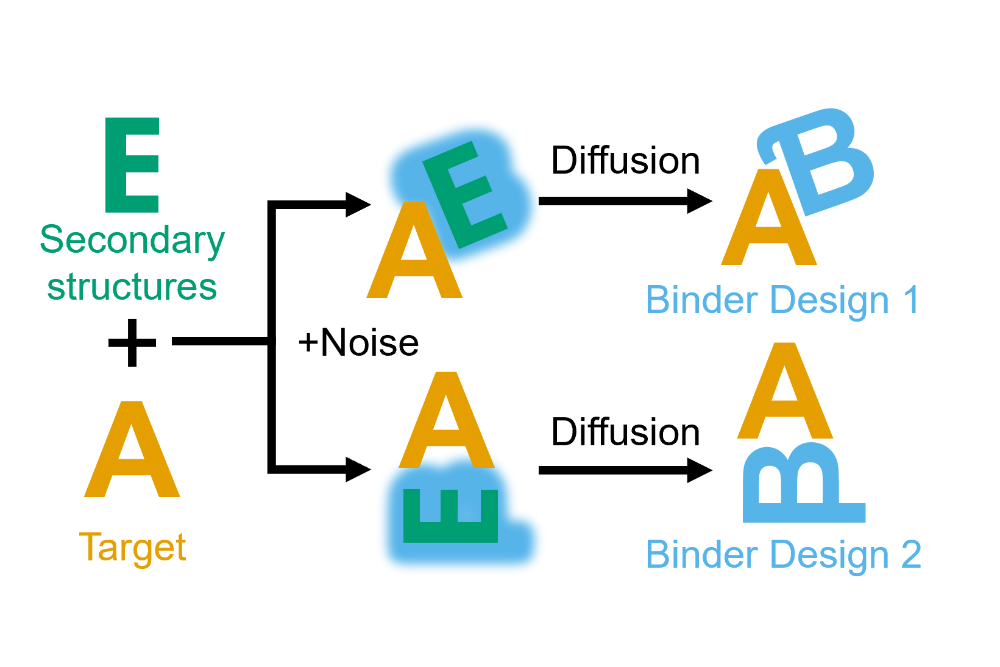
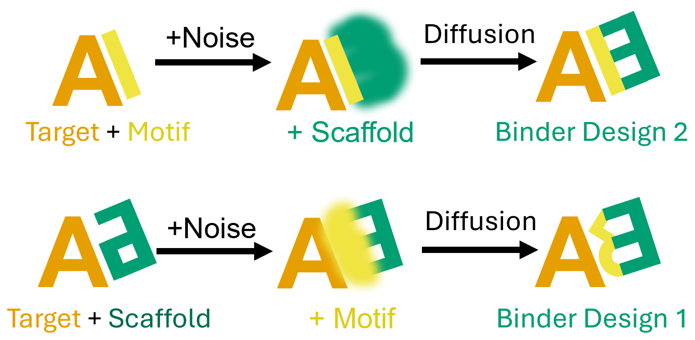
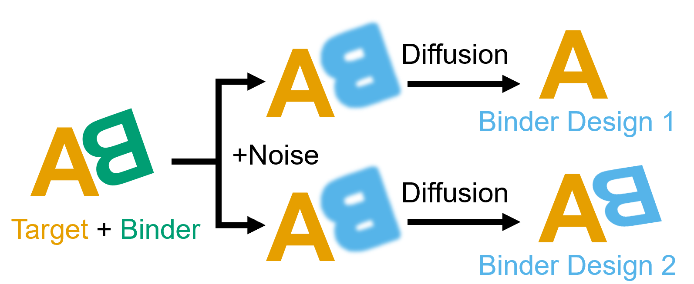

[🏠 ProteinDJ](../README.md) > Design Modes Guide

# ProteinDJ Guide to Design Modes

Due to the creative nature of protein design and the complexity of RFdiffusion there are many ways you can use ProteinDJ. To help with delineating this, we have created design modes for ProteinDJ. Each mode is described in detail below, but for now, here's a quick summary of each one with a simple illustration of each mode in action:

[**Monomer design**](#monomerdesign)
- [**monomer_denovo**](#mode-monomerdenovo) – diffusion of new monomers from noise
- [**monomer_foldcond**](#mode-monomerfoldcond) – diffusion of new monomers with fold-conditioning on scaffolds/templates
- [**monomer_motifscaff**](#mode-monomermotifscaff) – inpainting/extension of input monomers
- [**monomer_partialdiff**](#mode-monomerpartdiff) – partial diffusion of input monomers

[**Binder design**](#binderdesign)
- [**binder_denovo**](#mode-binddenovo) – diffusion of new binders from noise
- [**binder_foldcond**](#mode-bindfoldcond) – diffusion of new binders with fold-conditioning on scaffolds/templates
- [**binder_motifscaff**](#mode-bindmotifscaff) – diffusion of binding motifs in input scaffolds
- [**binder_partialdiff**](#mode-bindpartdiff) – partial diffusion of a binder from an input PDB
- [**bindcraft**](#mode-bindcraft) - hallucination of a binder using BindCraft

## Monomer Design <a name="monomerdesign"></a>

### Monomer De Novo Mode (monomer_denovo) <a name="mode-monomerdenovo"></a>

The simplest use of RFdiffusion, is to generate a monomeric protein from noise.



To generate a de novo monomer is straightforward. All we need to provide is a design length specifying the residue length range of the design. For example, to generate de novo proteins of length 80 residues, we provide the design_length `'80'`:

```
monomer_denovo {
    params {
        design_mode = 'monomer_denovo'
        design_length = '80'
    }
}
```

If we wanted to vary the length, we can specify a range e.g. `'80-150'` and RFdiffusion will randomly sample a length between 80 and 150 residues for each design:

```
monomer_denovo {
    params {
        design_mode = 'monomer_denovo'
        rfd_contigs = '80-150'
    }
}
```

For more details on De Novo protein design, see the [RFdiffusion GitHub](https://github.com/RosettaCommons/RFdiffusion/tree/main?tab=readme-ov-file#basic-execution---an-unconditional-monomer)

### Monomer Fold Conditioning Mode (monomer_foldcond) <a name="mode-monomerfoldcond"></a>

Fold conditioning guides the RFdiffusion diffusion process by providing secondary structure information from scaffolds e.g. barrels, helical bundles etc.



To run fold conditioning you need a directory containing pytorch files (`rfd_scaffold_dir`) with secondary structure and block adjacency information for each scaffold e.g. scaffold1_ss.pt scaffold2_adj.pt. You can generate these from a pdb or directory of pdbs using `scripts/create_scaffolds.py` (note this script requires a python environment with pyrosetta and pytorch installed). RFdiffusion will select a random scaffold from the directory for each design during the backbone diffusion process. Here we will use a directory of assorted scaffolds in `proteindj/binderscaffolds/scaffolds_assorted`.

```
monomer_foldcond {
    params {
        design_mode = 'monomer_foldcond'
        rfd_scaffold_dir = "./binderscaffolds/scaffolds_assorted"
    }
}
```

If you want to add more variation to the scaffolds, you can pass additional parameters to RFdiffusion (using the `rfd_extra_config` parameter). For example, to add up to 15 residues into any loop between secondary structure elements, and up to 5 additional residues at the N- and C-terminus:

```
monomer_foldcond {
    params {
        design_mode = 'monomer_foldcond'
        rfd_scaffold_dir = "./binderscaffolds/scaffolds_assorted"
        rfd_extra_config = "scaffoldguided.sampled_insertion=15 scaffoldguided.sampled_N=5 scaffoldguided.sampled_C=5"
    }
}
```

For more details on Fold Conditioning, see the official [RFdiffusion GitHub](https://github.com/RosettaCommons/RFdiffusion?tab=readme-ov-file#fold-conditioning)

### Monomer Motif Scaffolding Mode (monomer_motifscaff) <a name="mode-monomermotifscaff"></a>

Motif scaffolding, also known as inpainting, uses a reference scaffold and adds one or more motifs to generate a new structure.



We need to provide an input PDB file containing a single chain and contigs (contiguous residues) that specify which part of the structure we want to keep and where we want new residues to be inserted. For example, to add 5-15 residues to the N-terminus and 30-40 residues to the C-terminus of PL-D1:

```
monomer_motifscaff {
    params {
        design_mode = 'monomer_motifscaff'
        input_pdb = "./benchmarkdata/5o45_pd-l1.pdb"
        rfd_contigs = "[5-15/A17-131/30-40]"
    }
}
```
Note we need to specify 'A17-131' to tell RFdiffusion to keep these residues of the input PDB.

We could also replace the first 10 amino acids of chain A with 5-15 residues:

```
monomer_motifscaff {
    params {
        design_mode = 'monomer_motifscaff'
        input_pdb = "./benchmarkdata/5o45_pd-l1.pdb"
        rfd_contigs = "[5-15/A27-131]"
    }
}
```

Or we could even do multiple insertions/replacements within chain A of variable lengths:

```
monomer_motifscaff {
    params {
        design_mode = 'monomer_motifscaff'
        input_pdb = "./benchmarkdata/5o45_pd-l1.pdb"
        rfd_contigs = "[A17-43/9-15/A53-117/3-6/A121-131]"
    }
}
```

Finally, we can mask the sequence of the first three and last three residues to allow RFdiffusion to design new residues without changing the backbone using the `rfd_inpaint_seq` parameter

```
monomer_motifscaff {
    params {
        design_mode = 'monomer_motifscaff'
        input_pdb = "./benchmarkdata/5o45_pd-l1.pdb"
        rfd_contigs = "[A17-43/9-15/A53-117/3-6/A121-131]"
        rfd_inpaint_seq = "[A17-19/A129-131]"
    }
}
```

For more details on Motif Scaffolding, see the official [RFdiffusion GitHub](<[https://github.com/RosettaCommons/RFdiffusion/tree/main?tab=readme-ov-file#partial-diffusion](https://github.com/RosettaCommons/RFdiffusion/tree/main?tab=readme-ov-file#motif-scaffolding)>)

### Monomer Partial Diffusion Mode (monomer_partialdiff) <a name="mode-monomerpartdiff"></a>

RFdiffusing can partially noise and denoise a structure in a process referred to as 'partial diffusion'.



To partially diffuse a structure, we need to provide a path to the input PDB and contigs specifying the regions to keep and the regions to noise/denoise. The contigs must match the exact number of residues of the input PDB. If you do not provide contigs, ProteinDJ will automatically generate contigs that will partially diffuse all residues in the input PDB. Note if you provide an input PDB with multiple chains or with missing residues/gaps, RFdiffusion will stitch the sequences end-to-end to form a single chain that may not be desirable. We also must specify the timesteps to noise/denoise the structure. The full trajectory is 50 timesteps, so 20 timesteps is 40% of the normal noising/denoising trajectory.

For example, the PD-L1 structure has residues A17-131, 115 residues total. To partially diffuse the whole structure, we provide the total length in the contigs (`[115-115]`):

```
monomer_partialdiff {
    params {
        design_mode = 'monomer_partialdiff'
        input_pdb = "./benchmarkdata/5o45_pd-l1.pdb"
        rfd_contigs = "[115-115]"
        rfd_partial_diffusion_timesteps = 20
    }
}
```

To partially diffuse the last 20 residues only, we provide the residue range of the region we want to keep (A17-111), followed by the number of residues to partially diffuse (20). The total must add to the length of your input PDB. e.g.

```
monomer_partialdiff {
    params {
        design_mode = 'monomer_partialdiff'
        input_pdb = "./benchmarkdata/5o45_pd-l1.pdb"
        rfd_contigs = "[A17-111/20]"
        rfd_partial_diffusion_timesteps = 20
    }
}
```

For more details on Partial Diffusion, see the official [RFdiffusion GitHub](https://github.com/RosettaCommons/RFdiffusion/tree/main?tab=readme-ov-file#partial-diffusion)

## Binder Design <a name="binderdesign"></a>

To design binders with ProteinDJ, it is important to prepare your target structure. Ideally, your structure will be a high-resolution experimental structure or a high-confidence structural prediction. RFdiffusion and BindCraft will ignore ligands. Non-natural amino acids in protein chains will result in an error from RFdiffusion and be replaced by alanines in BindCraft, so it is best to replace these with a suitable natural amino acid before running ProteinDJ. Since the runtime of these programs scale exponentially with target size you might want to crop the size of your target to a minimal domain. See below for an example of how to prepare a structure. You should avoid exposing hydrophobic cores of your target domain as RFdiffusion/BindCraft will likely want to design a binder there (since they have a bias towards hydrophobic patches).



If you want to test your binder designs in the context of a larger structure or complex, you can provide a separate PDB file to AlphaFold2 Initial-Guess using the `uncropped_target_pdb` parameter. This is more computationally efficient - about 6x faster than using the same larger structure in RFdiffusion/BindCraft. Note that if RFdiffusion/BindCraft has designed the binder to an interface that is no longer available in the full context, this will be reflected by poor AlphaFold2 metrics, especially af2_rmsd_binder_tgtaln and af2_pae_interaction.

Contigs for binder design are more complicated than monomer design because we need to give information about the target and binder chains. Here are some examples to illustrate the specification of binder length. Your contigs must only include target residues that exist i.e. if you have missing loops or residues in your target you need to exclude them from the contig ranges. To make this easier, we have implemented automatic generation of contigs that will include all residues from the target and append the 'design_length', if relevant. To enable automatic generation of contigs, set `rfd_contigs` to null.



### Binder De Novo Mode (binder_denovo) <a name="mode-binddenovo"></a>

Binder de novo mode can be used to diffuse highly diverse binders to a target protein as illustrated below.


In this example, we are designing de novo binders against a target protein (PD-L1). We first need to decide on our target protein boundaries. It is important to keep the target protein minimal for computational efficiency without exposing hydrophobic patches. In this case we will include all residues from our input PDB so we can take advantage of automatic contig generation and only need to provide a design length e.g. `design_length = '60-100'` to diffuse binders of variable length between 60-100 residues. We are not specifying hotspot residues, so RFdiffusion will automatically identify binding sites for design.

```
binder_denovo {
    params {
        design_mode = 'binder_denovo'
        design_length = '60-100'
        input_pdb = "./benchmarkdata/5o45_pd-l1.pdb"
    }
}
```

Alternatively, you can use contigs to specify residues to include and the design length e.g. `rfd_contigs = "[A17-131/0 60-100]"` will give the same result as above i.e.  use the residues 17-131 from chain A and diffuse binders of variable length between 60-100 residues. Note the '/0' after the chain A residues that tells RFdiffusion to insert a new chain for the following residue range (the binder). We can also specify three hotspot residues to guide binder positioning (`hotspot_residues = "A56,A115,A123"`).

```
binder_denovo {
    params {
        design_mode = 'binder_denovo'
        input_pdb = "./benchmarkdata/5o45_pd-l1.pdb"
        rfd_contigs = "[A17-131/0 60-100]"
        hotspot_residues = "A56,A115,A123"
    }
}
```

We can also lower the noise scale used during diffusion (`rfd_noise_scale = 0`) and the temperature used for sampling sequences (`mpnn_temperature = 0.0001`) to reduce diversity and creativity but increase success rates (see configuration example below)

```
binder_denovo {
    params {
        design_mode = 'binder_denovo'
        input_pdb = "./benchmarkdata/5o45_pd-l1.pdb"
        rfd_contigs = "[A17-131/0 60-100]"
        hotspot_residues = "A56,A115,A123"
        rfd_noise_scale = 0
        mpnn_temperature = 0.0001
    }
}
```

Since RFdiffusion tends to produce alpha-helical rich binders, we can override the model checkpoint used for diffusion (defaults to `complex_base`) to increase the number of beta-strand rich binders (`rfd_ckpt_override = 'complex_beta'`). You might also want to try the 'binder_foldcond' mode with beta-strand binder scaffolds.

```
binder_denovo {
    params {
        design_mode = 'binder_denovo'
        input_pdb = "./benchmarkdata/5o45_pd-l1.pdb"
        rfd_contigs = "[A17-131/0 60-100]"
        hotspot_residues = "A56,A115,A123"
        rfd_ckpt_override = 'complex_beta'
        rfd_noise_scale = 0
        mpnn_temperature = 0.0001
    }
}
```

If your input PDB has multiple chains or chain breaks within chains, the contigs can be more complex. In these cases consider removing unwanted residues from the input PDB in ChimeraX/PyMOL and using automatic contig generation (i.e. `rfd_contigs = null`). Here are some examples of complex contigs:

(Example 1) Your input PDB structure has one chain (B) starting at residue 23 and ending at residue 105, but there is a chain break between residues 77-80. You want binders of length 100 residues.

`rfd_contigs = "[B23-77/80-105/0 100-100]"`

(Example 2) Your input PDB structure has two chains (A and B). Chain A is continuous (residues 1-77) but Chain B has a chain break between residues 77 and 80 (23-77,80-105). You want binders of variable length between 90-110 residues.:

`rfd_contigs = "[A1-77/0 B23-77/B80-105/0 90-110]"`

For more information on de novo binder design, see the official [RFdiffusion GitHub](https://github.com/RosettaCommons/RFdiffusion/tree/main?tab=readme-ov-file#binder-design)

### Binder Fold Conditioning Mode (binder_foldcond) <a name="mode-bindfoldcond"></a>

One approach to improving the success rate of binder design is to use scaffolds to guide RFdiffusion e.g. 3-alpha helical bundles.



To enable scaffold guided binder design you need a directory containing pytorch files (`rfd_scaffold_dir`) with secondary structure and block adjacency information for each scaffold e.g. scaffold1_ss.pt scaffold2_adj.pt. You can generate these from an input pdb or set of pdbs (see [Scaffold Generation Guide](../docs/scaffolds.md)). RFdiffusion will select a random scaffold from the directory for each design during the backbone diffusion process. We have generated pytorch files for the recommended scaffolds from [Cao et al. 2021](https://doi.org/10.1038/s41586-022-04654-9) (~23,000 templates) in `scripts/recmndscaffs.tar.gz` - see more details about the composition of these scaffolds and how to make your own [here](../docs/scaffolds.md).

RFdiffusion also requires these .pt files for the target PDB file. We generate these target .pt files internally for you using PyRosetta. We have noticed that ligands, insertion codes (e.g. res 82A, 82B), and non-standard amino acid codes (e.g. TPO, SEP) cause errors, so it is best to remove them from input structures first

Note that when using scaffolds contigs are ignored i.e. the binder length is determined by each template/scaffold and the entire input PDB is passed to RFdiffusion. You may need to edit your input PDB to remove unwanted residues/domains from the target protein first. 

The RFdiffusion GitHub also recommends setting `rfd_mask_loops = false` when using scaffolds for binder design. This will preserve the loops from the input scaffolds. If 'true', then RFdiffusion may vary the loops which will provide more diversity but lower success rates.

```
binder_foldcond {
    params {
        design_mode = 'binder_foldcond'
        input_pdb = "./benchmarkdata/5o45_pd-l1.pdb"
        hotspot_residues = "A56,A115,A123"
        rfd_scaffold_dir = "./binderscaffolds/scaffolds_assorted"
        rfd_mask_loops = false
    }
}
```

We can also lower the noise used during diffusion (`rfd_noise_scale = 0`) and the temperature used for sampling sequences (`mpnn_temperature = 0.0001`) to reduce diversity and creativity but increase success rates e.g.

```
binder_foldcond {
    params {
        design_mode = 'binder_foldcond'
        input_pdb = "./benchmarkdata/5o45_pd-l1.pdb"
        hotspot_residues = "A56,A115,A123"
        rfd_scaffold_dir = "./binderscaffolds/scaffolds_assorted"
        rfd_mask_loops = false
        rfd_noise_scale = 0
        mpnn_temperature = 0.0001
    }
}
```

For more details on Fold Conditioning, see the official [RFdiffusion GitHub](https://github.com/RosettaCommons/RFdiffusion?tab=readme-ov-file#fold-conditioning)

### Binder Motif Scaffolding Mode (binder_motifscaff) <a name="mode-bindmotifscaff"></a>

Motif scaffolding, also known as inpainting, uses a reference scaffold and adds one or more motifs to generate a new structure. We can use this to add binding motifs to an input structure.



We need to provide an input PDB file containing a binder and a target protein, and contigs that specify which part of the binder we want to keep and where we want new residues to be inserted. For example, we have a PDB structure with a binder (chain A, residues 1-88) and a target (chain B, residues 89-203). To add 5 residues to the N-terminus and 10-20 residues to the C-terminus of the binder (chain A) we would use the contigs "[5-5/A1-88/10-20/0 B89-203]". The '/0' indicates a chain break between the diffused residues and chain B.

By default, RFdiffusion will use the 'base' diffusion model checkpoint, but the RFdiffusion GitHub recommends using 'complex_base' or 'complex_beta' for motif scaffolding of binders.

```
    binder_motifscaff {
        params {
            design_mode = 'binder_motifscaff'
            input_pdb = "./lib/examplebinder.pdb"
            rfd_contigs = "[5-10/A1-88/10-20/0 B89-203]"
            rfd_ckpt_override = 'complex_base'
        }
    }
```

Our insertions length will be randomly chosen from the ranges provided, but we can constrain the length of the binder to 110 residues total, by using the rfd_length parameter e.g.

```
    binder_motifscaff {
        params {
            design_mode = 'binder_motifscaff'
            input_pdb = "./lib/examplebinder.pdb"
            rfd_contigs = "[5-10/A1-88/10-20/0 B89-203]"
            rfd_ckpt_override = 'complex_base'
            rfd_length = '110-110'
        }
    }
```

For more details on Motif Scaffolding, see the official [RFdiffusion GitHub](https://github.com/RosettaCommons/RFdiffusion/tree/main?tab=readme-ov-file#motif-scaffolding)

### Binder Partial Diffusion Mode (binder_partialdiff) <a name="mode-bindpartdiff"></a>

Partial diffusion is useful if you have an existing binder that you want to noise and denoise to generate variations. Note, this does not change the length of the binder.



We need to provide an input PDB containing the binder and target chains. The contigs must specify all the target chain residues (e.g. 'B89-203') as well as the exact length of the binder ('88-88/0'). If contigs are not provided, ProteinDJ will automatically generate contigs assuming chain A is the binder to be partially diffused and chain B is the target (preserved in its entirety). We also must specify the timesteps to noise/denoise the structure. The full trajectory is 50 timesteps, so 20 timesteps is 40% of the normal noising/denoising trajectory.

```
binder_partialdiff {
    params {
        design_mode = 'binder_partialdiff'
        input_pdb = "./lib/examplebinder.pdb"
        rfd_contigs = "[88-88/0 B89-203]"
        rfd_partial_diffusion_timesteps = 20
    }
}
```

For more details on Partial Diffusion, see the official [RFdiffusion GitHub](https://github.com/RosettaCommons/RFdiffusion/tree/main?tab=readme-ov-file#partial-diffusion)

### BindCraft Mode (bindcraft) <a name="mode-bindcraft"></a>

The above modes utilise RFdiffusion for fold design, but we have also integrated [BindCraft](https://github.com/martinpacesa/BindCraft) as an alternative software for binder generation. BindCraft is specialised for de novo binder design and uses a hallucination approach to iteratively optimise a random sequence using AlphaFold2 Multimer. Note that BindCraft was built as a complete binder design pipeline, including internal sequence design and structure prediction steps, but in ProteinDJ we are only using the first hallucination stage of the BindCraft pipeline and are passing these designs to our own sequence design and structure prediction processes.

BindCraft requires an input PDB and a design length from which it will randomnly sample. For example, to design binders of length 60-100 for PDL1 you can use this profile:

```
bindcraft {
        params {
            design_mode = 'bindcraft'
            design_length = '60-100'
            input_pdb = './benchmarkdata/5o45_pd-l1.pdb'
        }
}
```
As with RFdiffusion modes, there are optional parameters we can use to guide BindCraft. You can provide hotspot residues (comma-separated with chain IDs e.g. `hotspot_residues = 'A56,A123'`). BindCraft does not utilise contigs but you can optionally provide chain IDs to include from the input PDB e.g. `bc_chains = 'A,B'` If `bc_chains` is not provided, BindCraft will automatically include all protein chains from the input PDB.
```
bindcraft {
        params {
            design_mode = 'bindcraft'
            design_length = '60-100'
            input_pdb = './benchmarkdata/5o45_pd-l1.pdb'
            hotspot_residues = 'A56,A115,A123'
            bc_chains = 'A'
        }
}
```

As with binder design modes, it is useful to include structure prediction filters to identify the best binder designs.

```
bindcraft {
        params {
            design_mode = 'bindcraft'
            design_length = '60-100'
            input_pdb = './benchmarkdata/5o45_pd-l1.pdb'
            hotspot_residues = 'A56,A115,A123'
            af2_max_pae_interaction = 10
            af2_min_plddt_overall = 90
            af2_max_rmsd_binder_bndaln = 1.5
        }
}
```

BindCraft offers more advanced settings and several protocols are available with preset settings. If you are trying to design beta-sheeted binders try setting `bc_design_protocol` to `'betasheet'`. There is also a protocol for peptide design `bc_design_protocol = 'peptide'`. If your target protein has flexible regions you can also try `bc_template_protocol = 'flexible'`, which will allow for larger changes to target protein conformation during binder design iterations. As implemented in the BindCraft design pipeline, by default we preserve/fix the sequence of binder residues near the target interface when performing downstream sequence design, but this behaviour can be disabled by setting `bc_fix_interface_residues = false`. 

For more details on BindCraft, see the official BindCraft [GitHub](https://github.com/martinpacesa/BindCraft) and [publication](https://doi.org/10.1038/s41586-025-09429-6). Note that since we are skipping the internal MPNN and AF2 prediction steps of BindCraft and using our own implementation, some of the advanced settings and filtering settings described will not be relevant for ProteinDJ. Refer to the ProteinDJ [Parameter Guide](docs/parameters.md) and [Filtering Guide](docs/parameters.md/#filtering-parameters) for what options are available here.

[⬅️ Back to Main README](../README.md)