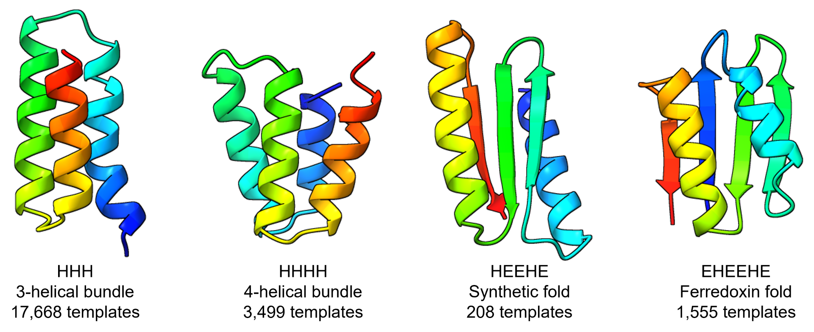

[🏠 ProteinDJ](../README.md) > Scaffold Generation Guide

## Scaffold Generation Guide

### Scaffold Data from Cao et al. 2021 <a name="append-scaffolds"></a>

We have generated pytorch files for the recommended binder scaffolds from [Cao et al. 2021](https://doi.org/10.1038/s41586-022-04654-9) (~23,000 templates) in compressed archives in `binderscaffolds/` - see more details about the composition of these scaffolds below. If you want to test a mixture of scaffold types you can use the directory `binderscaffolds/scaffolds_assorted` which contains 100 scaffolds files for each fold type.



| **Prefix** | **Description**                                                            | **Count** |
| :--------- | :------------------------------------------------------------------------- | --------: |
| HHH        | "3-helical bundles"                                                        |     17668 |
| HHHH       | "4-helical bundles"                                                        |      3499 |
| HEEHE      | "Mixed alpha-helical (H) and beta-strand (E) scaffold. Artificial."        |       208 |
| EHEEHE     | "Mixed alpha-helical (H) and beta-strand (E) scaffold based on ferredoxin" |      1555 |

The initials following the prefix indicate the source author and publication:

- ems - Eva Maria Strauch - Scaffolds published in _Sampling of Structure and Sequence Space of Small Protein Folds_
- hh - Hugh Haddox - Scaffolds published in _Perturbing the energy landscape for improved packing during computational protein design_
- lc - Longxing Cao - Scaffolds published in _Design of protein-binding proteins from the target structure alone_
- bc - Brian Coventry - Scaffolds published in _Design of protein-binding proteins from the target structure alone_

For binder design we recommend using these scaffolds, as they have been short-listed by the Baker Lab from millions of folds according to their in silico metrics (see supplementary files of [Cao et al. 2021](https://doi.org/10.1038/s41586-022-04654-9)). For other applications, or if you want to generate your own scaffold pytorch files, you can use the script `scripts/create_scaffolds.py` (a parallelised version of a script from https://github.com/RosettaCommons/RFdiffusion/tree/main/helper_scripts). We have noticed that ligands, insertion codes (e.g. res 82A, 82B), and non-standard amino acid codes (e.g. TPO, SEP) cause errors, so it is best to remove them from input structures first. You will need a python environment with pyrosetta and pytorch installed. e.g. for micromamba:

```
micromamba create -n pyrosetta
micromamba activate pyrosetta
micromamba install -c https://conda.rosettacommons.org pyrosetta pytorch
```

You need to provide the directory containing your input PDB files, the output directory, and the number of CPUs for parallel processing (defaults to 1). e.g.

```
micromamba activate pyrosetta
python scripts/create_scaffolds.py --pdb_dir inputpdbs/ --out_dir scaffolds/ --num_processes 4
```

[⬅️ Back to Main README](../README.md)
